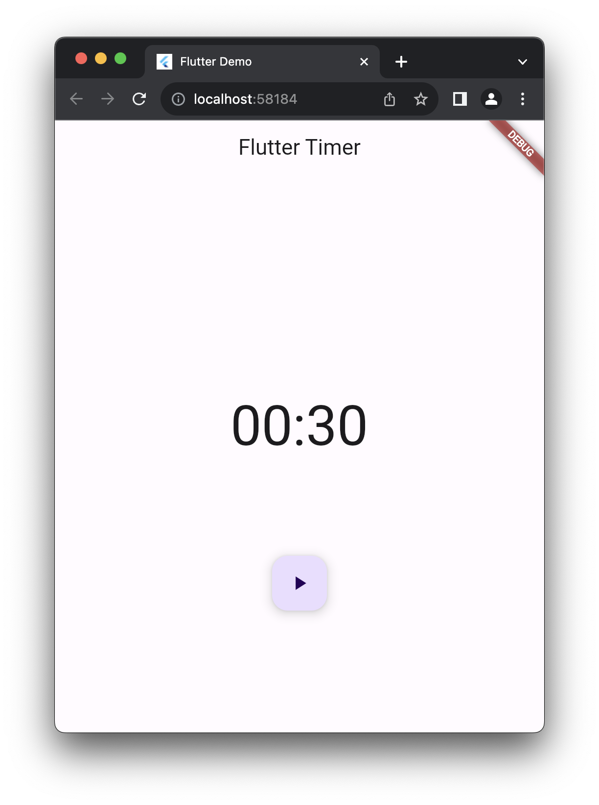
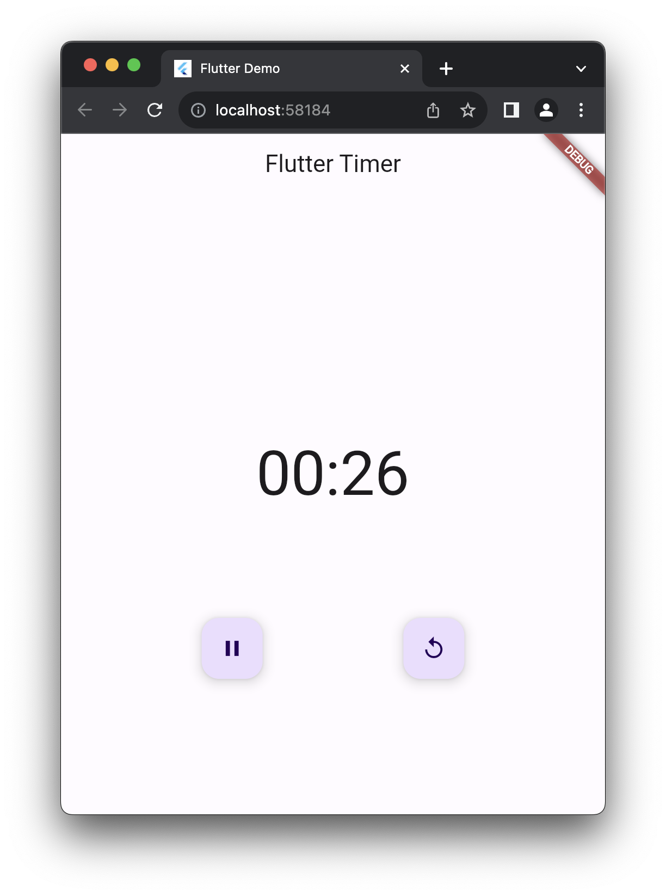

# flutter_bloc_workshop

Flutter bloc workshop. This project contains 3 different sample projects that are used to demonstrate the use of bloc in flutter. 


1. Counter App (Using cubit)

2. Timer App (Using bloc and bloc_test)

3. Product App (Complete application with MVVM architecture using bloc) 
   
## Pre-requisites

1. Flutter SDK version 3.13.6 or above


## Getting Started

All the sample projects are in different branches. To get started, clone the repo and checkout the branch you want to work on.

```
git clone
git checkout <branch-name>
```

## Introduction

All the project have a common structure. The project structure is as follows:

```
lib
lib/app - Contains the application specific code
lib/data - Contains the data layer code (Repository, API, Database)
lib/feature - Contains the feature specific code 
lib/utils - Contains the utility code

## Counter App 

Branch: step-2.1

This is a simple counter app that uses cubit to manage the state.


## Timer App

Branch: step-3.3

This is a simple timer app that uses bloc to manage the state. It also uses bloc_test to test the bloc.
Also written a custom bloc observer to log the state changes.





